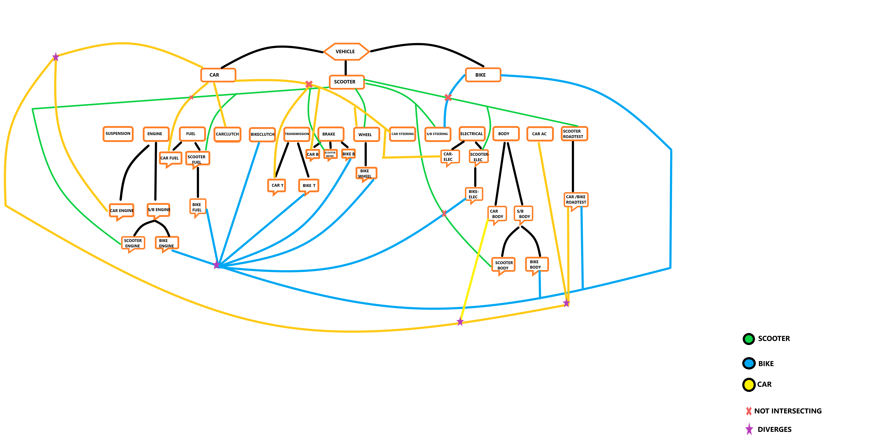

# Vehicle Service Management
A vehicle service managing software developed using C++ in object-oriented approach to track the servicing of vehicles.
## Concepts used :
* Exception handling
* File handling
* Overloading
## Description :
* A login is provided where only the admin can login.
* He can choose car,bike or scooter to service and the software displays the various parts respective of the vehicle.
* The parts are modelled under each category using classes.
* The admin can keep track of each part serviced.
* Finally, the software generates an invoice for the parts serviced and also stores it in a file.
* Operator overloading is used to generate the invoice in a file.
* Exception handling is used to reduce errors.  

